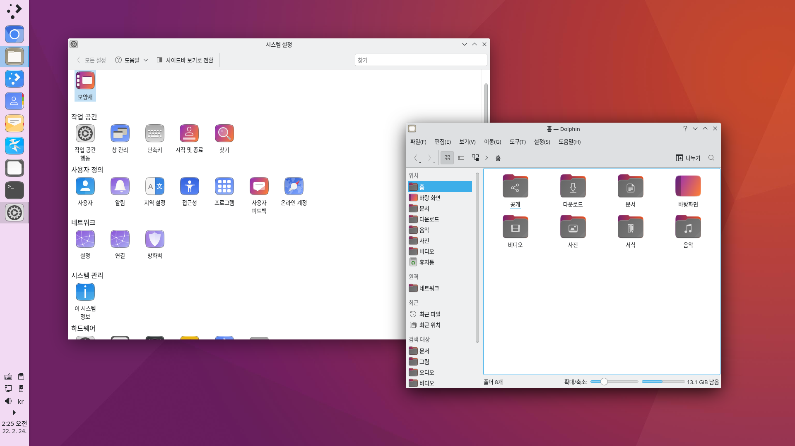
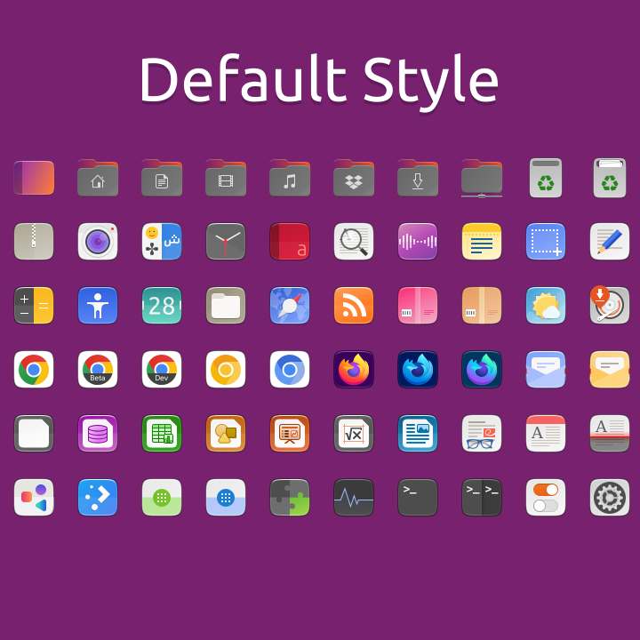
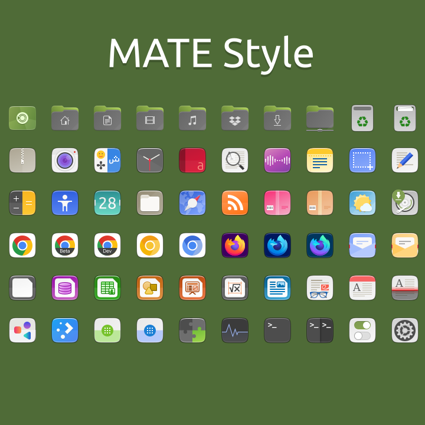
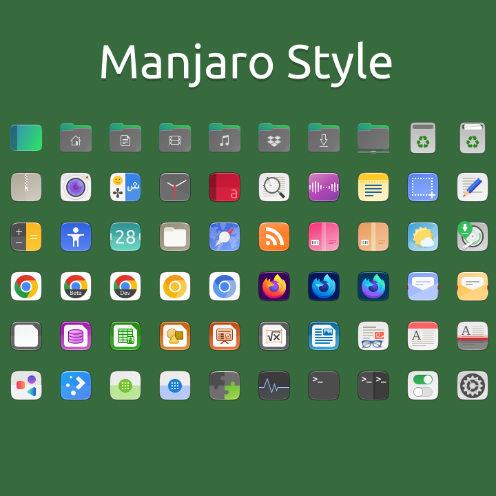
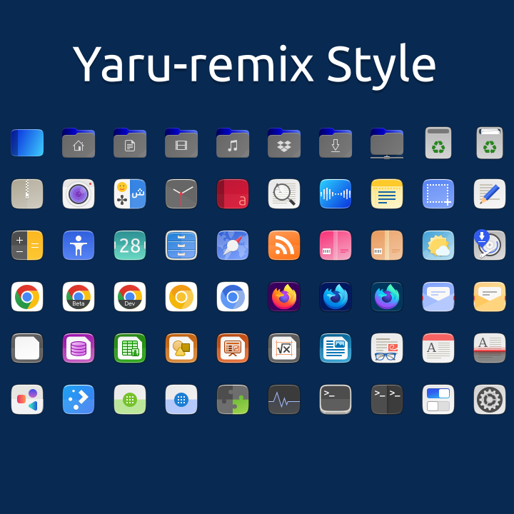

# Naru-icons

Yaru-icons with Other Distro Colors and Desktop Environments

# Features

* Squircle Design - Looks like One UI, iOS, macOS Big Sur

# Varients

* Default - Default is Best customization, but different

* MATE - Yaru-MATE's Naru Mod

* Manjaro - Ubuntu theme with Manjaro Color

* Remix - Yaru-remix color

# Preview

